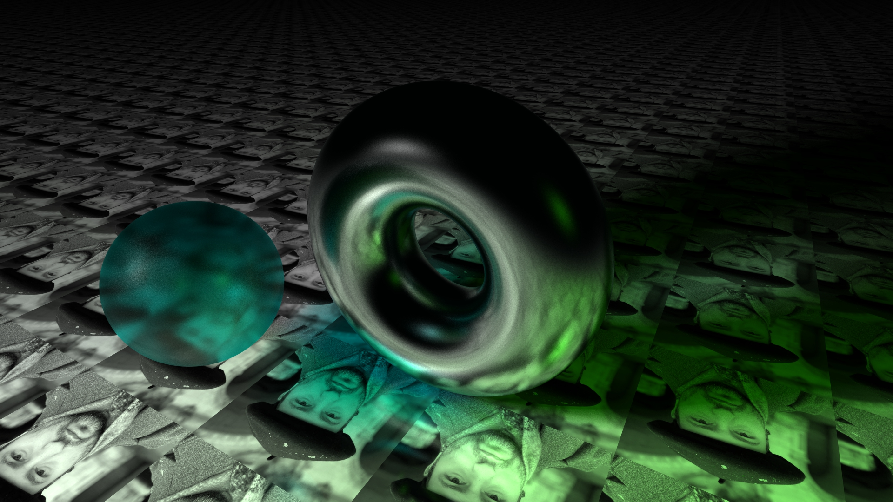

# Realistic CPU ray tracing (arch linux build)



API for rendering realistic mathmatical shapes, triangulated primitives and more using ray tracing algorithm.

## Getting Started

### Dependencies

Make sure you have:

- `g++` compiler with `C++20+` support
- `cmake` version >= 4.0
- `make`
- Additional libraries: `SDL2`

### Build instructions

```bash
git clone https://github.com/TimmPeterson/tp5-rt.git
cd tp5-rt
mkdir build && cd build
cmake -DCMAKE_EXPORT_COMPILE_COMMANDS=ON .. 
make
./bin/tp5-rt
```

## Structure
```
tp5-rt
├── include/tp5/
│   └── rt.h <--------- general header file
├── lib/    
├── build/ 
│   └── bin/ <--------- executable directory
├── src/
│   ├── rt/
│   │   ├── shapes/
│   │   ├── lights/
│   │   └── mods/
│   ├── win/ <--------- OS dependend
│   ├── frame/
│   └── mth/
└── CMakeLists.txt
```

## Usage Example

```cpp
#include "tp5/rt.h"

int main( void )
{
  const int 
    WIDTH  = 512,
    HEIGHT = 256;

  // Create the window
  rt::rt_win MyWin(WIDTH, HEIGHT);

  // Create shapes
  auto *sph = new rt::sphere(...);
  auto *tor = new rt::torus(...);

  // Create light sources
  auto *lig = new rt::point_light(...);
  
  // Add all stuff to the scene
  MyWin.Scene << sph << tor << lig;

  // Run the window
  MyWin.Run();
}
```

### Math handling

```cpp
using namespace tp5;

/***
 * Vectors
 ***/

vec3 v1    = vec3(4, 2, -1); // --> (4, 2, -1)
vec3 v2    = vec3(3);        // --> (3, 3, 3)
vec3 cross = v1 % v2;        // --> (9, -15, 6)
double    dot   = v1 & v2;   // --> 15.0
double    len   = !v1;       // --> 4.58257

// Other common linear operations are defined as well

/***
 * Matricies 
 ***/

matr m1 = matr(
            0, 0, 0, 0,
            0, 0, 0, 0,
            0, 0, 0, 0,
            0, 0, 0, 0
          );
matr m2 = matr(1); // ---> Identity matrix
matr m3 = m1 * m2;

matr id = matr::Identity();
matr tr = matr::Translate(v1);
matr sc = matr::Scale(v1);
matr ro = matr::Rotate(30.0, v1);
//                     ^^^^  ^^
//                  degrees  axis

matr vi = matr::View(v1, v2, v3);
//                   ^^  ^^  ^^
//                  loc  at  up

/***
 * Vectors x Matricies
 ***/

vec3 
  /* Applies as 3x3 matrix                               */
  transformed_vector           = m1.VectorTransform(v1),
  
  /* Applies as 3x3 but as Invert(Transpose(m1))         */
  transformed_normal           = m1.TransformNormal(v1),

  /* Applies as 4x4 to (v1.x, v1.y, v1.z, 1)             */
  transformed_point            = m1.PointTransform(v1), 
  
  /* Same as previous but then devides by last component */
  completely_transformed_point = m1.Transform4x4(v1);

/***
 * Camera
 ***/

camera cam;

cam.Resize(
  512,           // Width
  256            // Height
);
cam.SetProj(
  1.0,           // Projection size
  0.1,           // Projection distance
  100            // Far clip
); 
cam.SetLocAtUp(
  vec3(5.0),     // Camera location
  vec3(0.0),     // Point of interest
  vec3(0, 1, 0)  // Up direction
);

/* Returns ray from the origin 
 * to the certain pixel on the sreen
 */
ray r = cam.FrameRay(123, 456); // <-- pixel coordintes

/*
 * There are also types:
 *   - vec2
 *   - vec4
 *   - ray
 *
 * Their usage is kinda intuitive.
 *
 * By default the component type for these types is double.
 * However you can find templates of these types in `mth` namespace
 * and create instances of them with any component type. 
 */
```